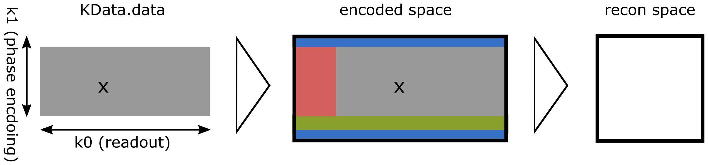

===
FAQ
===

What is encoded-space and recon-space?
======================================
The resolution and field-of-view of the reconstructed image does not necessarily have to be the same as the acquisition
resolution and matrix size. The extend of the encoded k-space is given by the ``encoding_matrix``. Below is an example.
The data was acquired with partial Fourier along the readout and the readout (k0) and along the phase encoding (k1)
direction. In addition the acquired resolution along the phase encoding direction was lower than for the final image.
I.e the highest sampled k-space frequency along k1 was lower than required based on the desired image resolution.

In order to to sort the acquired k-space (gray) into the encoded k-space (black box), we need to zero-pad the partial
Fourier along k0 (red box), zero-pad the partial Fourier along k1 (green box) and zero-pad along k1 to get to the
correct resolution (blue boxes). Of course this will not really increase the resolution of our image but will simply
ensure the correct voxel size.

Finally the acquired data was also oversampled by a factor of 2 along the readout. This then needs to be cropped. The
recon-space is therefore half the encoded-space along k1.

More information on this can also be found here: `MRD-docu <https://ismrmrd.readthedocs.io/en/latest/mrd_header.html>`_

Some parameters in my MRD-file are wrong. What shall I do?
==========================================================
MRpro is designed to handle valid raw data files. Therefore, it is not a good idea to try to compensate for errors in
the MRD file in MRpro. The best solution of course is to fix the source of the error. Nevertheless, if you have already
acquired data then of course it is often not easy to reacquire everything. The next best thing is to use MRD-tools to
fix the MRD-file. One option is to use the PyPi package of `MRD <https://pypi.org/project/ismrmrd/>`_. With a simple
script such as e.g.:

.. code-block:: python

    import ismrmrd

    # Get info and acquisitions from original data
    with ismrmrd.File(fname_wrong_header, 'r') as file:
        ds = file[list(file.keys())[0]]
        mrd_header = ds.header
        acquisitions = ds.acquisitions[:]

    # Correct wrong entries in header
    mrd_header.encoding[0].reconSpace.matrixSize.y = 192
    mrd_header.encoding[0].reconSpace.matrixSize.z = 192

    # Create new file and add header and data
    ds = ismrmrd.Dataset(fname_correct_header)
    ds.write_xml_header(mrd_header.toXML())

    for acq in acquisitions:
        ds.append_acquisition(acq)
    ds.close()
   ...

the header information of the raw-data file can be adapted. This can also be used to add trajectory information to the
raw-data or select only a subset of the acquired data.
